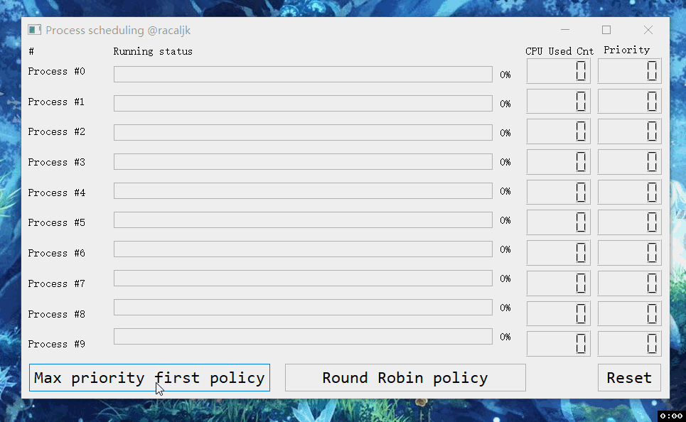

# 桂林理工大学操作系统实习
[English](README.md) | [中文](README.CN.md)

## 2016级软件工程2班 2018年5月7日
## 姓名：杨易 学号：3162052051639

## 前言
对我来说，每学期最令人期待的事情莫过于各种实习。我有大量的时间可以从头写一些经典、有趣的算法/策略。它们中的深邃思想非亲自实践不可得。古言思而不学则殆，不恰当的类比就是没有理论支撑的实践很容易因为拙劣迂回的解而让给自己造成它不过如此的假象。学而不思则罔，这次实践是个"学"后而"思"的机会，纯理论学习我觉得是很没意思的，因为你甚至不知道它该在哪些地方使用，以及为什么要使用它而不是一些简单直白的方法。废话完毕，代码如下。

## 第一部分：源码分析
> 源码基于 `linux v2.6.39`, 可以从这里获取 [https://elixir.bootlin.com/linux/v2.6.39/source](https://elixir.bootlin.com/linux/v2.6.39/source). 这是对linux系统调用`fork()`的源码分析, 它会从父进程派生出一个子进程，子进程也会记录父进程的一些资源如文件描述符。`fork()`源码可以从 [https://elixir.bootlin.com/linux/v2.6.39/source/kernel/fork.c](https://elixir.bootlin.com/linux/v2.6.39/source/kernel/fork.c)获取。另外为了简洁删除了一些不太重要的代码段和注释：），因为我只想分析个大概而不是视若字字珠玑捧读...

+ [Linux系统调用`fork()`分析](SYSTEM_CALL_FORK.md)

## 第二部分：用特设代码模拟OS行为
+ [**:white_check_mark: Project 1 :进程调度**](https://github.com/cthulhujk/glut_os_practice/tree/master/src/ProcessScheduling)
> 模拟最大优先级调度和轮询调度

[Windows GUI版下载](bin/SchedulingGUI.exe)
+ [**Project 2 : 进程同步  WORKING**](https://github.com/cthulhujk/glut_os_practice/tree/master/src/ThreadSync)
> 经典读写者问题的模拟。
+ [**:white_check_mark: Project 3 : 哲学家进餐问题**](https://github.com/cthulhujk/glut_os_practice/tree/master/src/DeadLock)
> 该问题由Dijkstra与1965年提出。Dijkstra也给出了解决方案。这里使用最简单的全局互斥锁解决...

+ [**:white_check_mark: Project 4 : 页面置换**](https://github.com/cthulhujk/glut_os_practice/tree/master/src/PageReplacement)
> 模拟FIFO和LRU页面置换，并给出两者的缺页数据

+ [**:negative_squared_cross_mark: Project 5 : 磁盘调度 (这个没写，因为完全不感兴趣...)**]()

+ [**Project 6 : 文件系统 WORKING**](https://github.com/cthulhujk/glut_os_practice/tree/master/src/YFileSystem)

## License
没有License，你可以用它做任何你想做的事情。
